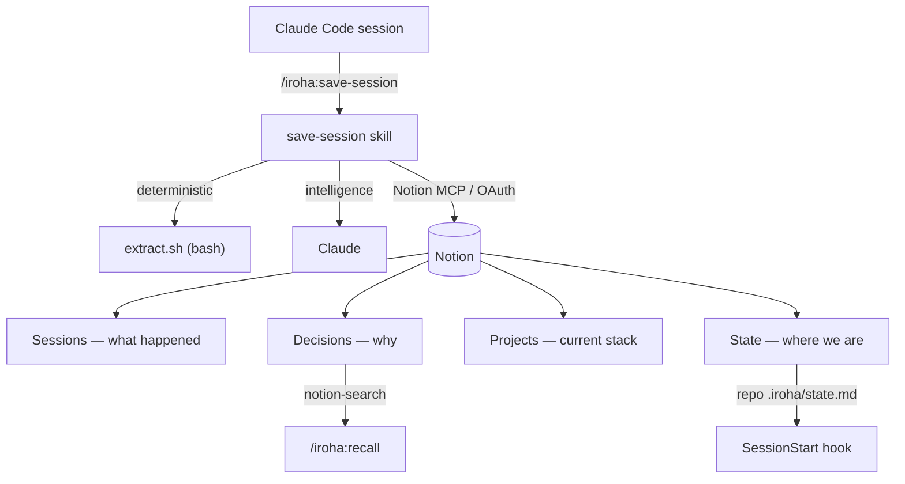

# iroha for Notion

[English](README.md) | **日本語**

> Claude Code のセッションを Notion に「生きた・検索できる**チーム記憶**」として保存します —
> 意思決定（理由と却下した代替案つき）・作業状態・チャット形式のハイライト・プロジェクトごとの
> アーキテクチャ。人間も将来の Claude セッションも、何を・なぜ決めたか、何が未完了か、どう作られて
> いるかを思い出せます。

[](LICENSE)
[](https://github.com/hir4ta/iroha-for-notion/actions/workflows/ci.yml)

## なぜ

Claude Code の組み込み記憶は薄く、1台のマシンに閉じています。iroha は各開発セッションを Notion 上の
構造化された検索可能な記憶に変えます。次のセッション（あなた自身でもチームメイトでも）は、プロジェクトの
意思決定・未完了の作業・構成を**すでに知った状態**で始まります。使うほど育ち、「前に似たものを作ったっけ?」
と聞けば、過去のセッション・変更したファイル・その理由を指し示します。

## 仕組み

- **ランタイムは pure bash**（`scripts/extract.sh`、`set -u` + `jq`）: セッションのトランスクリプトから
  決定論的な抽出（変更ファイル・コマンド・メタ情報）を行います。**知性**（要約・意思決定・分類・ハイライト）
  はスキル内の Claude が担います。
- Notion の読み書きはすべて **Notion MCP** 経由 — **API トークンは不要**。認証は MCP の OAuth だけなので
  セットアップは接続1回。リコールは**無料プラン**でも動く `notion-search` を使います。
- SessionStart フックがプロジェクトの **State**（リポジトリ内の小さなミラー）を注入するので、Claude が
  「前回どこまで・何が未完了か」を自分から教えてくれます。

## 記憶モデル — 3層 + State



- **Sessions** — 各回に何が起きたか: 要約・下した意思決定・チャットハイライト・変更ファイル。
- **Decisions** — *なぜ*今の形なのか: 理由 + 却下した代替案、supersession（方針転換）の履歴つき。
- **Projects** — *今プロジェクトに何があるか*: 言語・主要ライブラリ・開発ツール・CI・アーキテクチャ図。オンボーディングと横断検索のため。
- **State ページ** — 常に最新の「今どこ / 何が未完了」。セッション開始時に注入されます。

## 必要なもの

- [Claude Code](https://code.claude.com/docs)
- Notion アカウント + **ホスト型 Notion MCP** の接続（OAuth）。**無料プラン**で動きます。

## インストール

Claude Code 内で:

```
/plugin marketplace add hir4ta/iroha-for-notion
/plugin install iroha@iroha-for-notion
```

## はじめかた

1. **Notion MCP を接続** — `/mcp` を実行し `notion` を選び、ブラウザで OAuth を完了。
2. **`/iroha:init`** — `Sessions` / `Decisions` / `Projects` データベース（Recent / Active / By Language ビューつき）を、選んだ Notion ページ配下に作成。共有ページで再実行すればチームメイトが**参加**できます。
3. **`/iroha:save-session`** — 今のセッションを保存。
4. **`/iroha:recall <query>`** — 「X をやらないと決めた? 理由は?」「前に作ったっけ?」。
5. **`/iroha:project`** — プロジェクトの技術スタックを記録/更新（手動・エンジニアレビュー）。

## コマンド

| コマンド | 何をするか |
| --- | --- |
| `/iroha:init` | 一度きりのセットアップ（冪等）: Notion DB + ビューを作成 or 参加。 |
| `/iroha:save-session` | このセッションを保存: 要約・意思決定・変えたルール・作業状態・ハイライト・変更ファイル。 |
| `/iroha:recall <query>` | Sessions + Decisions を意味検索し、過去の決定や類似の過去作業を引く。 |
| `/iroha:project` | このプロジェクトのアーキテクチャ記録を作成/更新（手動）。 |

## iroha が**しない**こと

- **秘密を持たない。** 管理する API トークン無し — Notion 認証は MCP OAuth のみ、ローカルには非秘密の id だけ。
- **relation プロパティを使わない。** Session↔Decision は URL プロパティで連結（Notion MCP の relation 書き込みの既知バグ回避）。安定後にネイティブ relation へ昇格可。
- **全文ダンプをしない。** チャットは要点だけの折りたたみ**ハイライト**として残します。
- **保存を強制しない。** フックはリマインドのみ、ブロックはしません。

## 設計

- アーキテクチャ不変条件: [`.claude/rules/architecture.md`](.claude/rules/architecture.md)
- プロジェクトのメモ・スコープ: [`CLAUDE.md`](CLAUDE.md)
- 貢献: [`CONTRIBUTING.md`](CONTRIBUTING.md) · セキュリティ: [`SECURITY.md`](SECURITY.md)

## ライセンス

[MIT](LICENSE) © Shunichi Hirata
