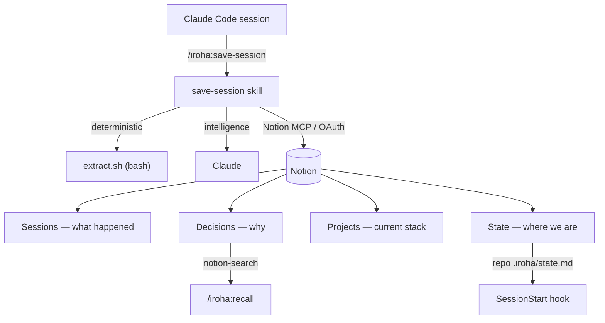

# iroha for Notion

[English](README.md) | **日本語**

**Claude Code との会話を、Notion に「育つチームの記憶」として残すプラグインです。**

セッションが終わるたびに、その回で何を・なぜ決めたか、何が残っているか、どう作られているかを
Notion に整理して保存します。

次に開くセッションは——自分のでもチームメイトのでも——ちゃんと続きから始められます。

[](LICENSE)
[](https://github.com/hir4ta/iroha-for-notion/actions/workflows/ci.yml)

## こんな課題に

Claude のメモリは便利ですが、薄いし、しかも自分のマシンの中だけ。

「あの判断、なんでそうしたんだっけ?」「前に似たもの作らなかった?」が、毎回ふりだしに戻ります。

iroha は、その記憶を Notion に逃がします。

検索できて、チームで共有できて、使うほど厚くなる。「前に似た実装したっけ?」と聞けば、
その時のセッション・触ったファイル・理由まで返ってきます。

## どう動くのか

役割はシンプルに分かれています。

- **決まりきった抽出は bash に。** `scripts/extract.sh`（pure bash + jq）が、トランスクリプトから変更ファイル・コマンド・メタ情報を取り出します。
- **頭を使うところは Claude に。** 要約・意思決定の抽出・分類・チャットのハイライトは、スキルの中で Claude 本体が書きます。
- **Notion とのやりとりは MCP だけ。** API トークンは持ちません。認証は Notion MCP の OAuth ひとつ。検索（リコール）は無料プランでも動く `notion-search` を使います。

セッションを開いた瞬間、フックがプロジェクトの「現在地」を注入します。

だから Claude は、頼まなくても「前回ここまで、これが未完了です」と教えてくれます。

## 記憶のかたち — 3層 + State



| 層 | 役割 |
| --- | --- |
| **Sessions** | その回に何が起きたか（要約・下した決定・ハイライト・変更ファイル）。 |
| **Decisions** | なぜ今の形なのか（理由と却下案。方針転換の履歴も残ります）。 |
| **Projects** | いま何で出来ているか（言語・ライブラリ・CI・構成図）。オンボーディングと横断検索に。 |
| **State** | 「今どこ / 何が残っているか」。セッション開始時に注入されます。 |

## 必要なもの

- Claude Code
- Notion アカウントと、ホスト型 Notion MCP の接続（OAuth）

無料プランでそのまま動きます。

## 入れる

Claude Code の中で:

```
/plugin marketplace add hir4ta/iroha-for-notion
/plugin install iroha@iroha-for-notion
```

## はじめかた

1. **Notion をつなぐ** — `/mcp` から `notion` を選び、ブラウザで OAuth を済ませます。
2. **`/iroha:init`** — Sessions / Decisions / Projects のデータベースを、選んだページの下に作ります。チームで使うなら、同じページで誰かが実行すれば参加できます。
3. **`/iroha:save-session`** — いまのセッションを保存。
4. **`/iroha:recall <調べたいこと>`** — 「X をやめたのはなぜ?」「前に作ってない?」
5. **`/iroha:project`** — プロジェクトの技術スタックを記録します（手動。エンジニアが確認してから）。

## コマンド

| コマンド | 何をするか |
| --- | --- |
| `/iroha:init` | 一度きりのセットアップ（冪等）。Notion の DB とビューを作る、または既存に参加する。 |
| `/iroha:save-session` | このセッションを保存。要約・決定・変えたルール・作業状態・ハイライト・変更ファイル。 |
| `/iroha:recall <query>` | Sessions と Decisions を意味検索。過去の決定や、似た過去作業を引く。 |
| `/iroha:project` | このプロジェクトのアーキテクチャを記録／更新（手動）。 |

## あえて、やらないこと

- **秘密は持たない。** 管理する API トークンはありません。認証は MCP の OAuth だけ、手元に置くのは秘密でない id だけです。
- **relation プロパティは使わない。** Notion MCP の relation 書き込みにバグがあるので、URL で連結しています（安定したら乗り換え可）。
- **会話を丸ごとは残さない。** 大事なやりとりだけを、折りたためる「ハイライト」として残します。
- **保存を強制しない。** フックはそっと促すだけ。あなたを止めたりはしません。

## もっと知る

- 設計の不変条件 — [`.claude/rules/architecture.md`](.claude/rules/architecture.md)
- プロジェクトのメモとスコープ — [`CLAUDE.md`](CLAUDE.md)
- 開発に参加する — [`CONTRIBUTING.md`](CONTRIBUTING.md) ／ セキュリティ — [`SECURITY.md`](SECURITY.md)

## ライセンス

[MIT](LICENSE) © Shunichi Hirata
