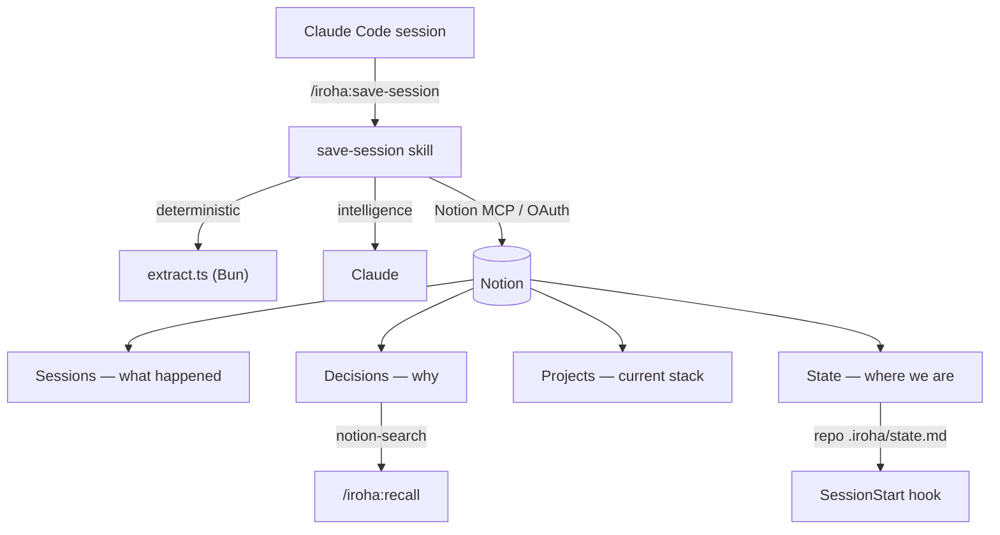

# iroha

> **Sessions scatter. iroha remembers.**

**English** | [日本語](README.ja.md)

> Persist Claude Code sessions to Notion as a living, queryable **team memory** —
> decisions (with rationale and rejected alternatives), work-state, chat-style
> highlights, and per-project architecture profiles. So humans *and* future Claude
> sessions can recall what was decided, why, what's unfinished, and how things are built.

[](LICENSE)
[](https://github.com/hir4ta/iroha-for-session/actions/workflows/ci.yml)

## Why

Claude Code's built-in memory is thin and lives on one machine. iroha turns each coding
session into structured, searchable memory in Notion, so that the next session — yours
or a teammate's — opens already knowing the project's decisions, its unfinished work,
and how it is built. The more the team uses it, the more it grows: ask *"have we built
something like this before?"* and iroha points at the prior session, the files it
changed, and why.

## How it works

- The **runtime is Bun + TypeScript** (`scripts/**/*.ts`, run directly with no build step):
  it does the deterministic extraction (changed files, commands, metadata) from the session
  transcript. The **intelligence** (summary, decisions, classification, chat highlights)
  is produced by Claude inside the skills.
- All Notion reads/writes go through the **Notion MCP** — there is **no API token**.
  Auth is the MCP's OAuth, so setup is a single connection. Works on the **free** Notion plan.
- **Recall is two-stage.** On every prompt, a `UserPromptSubmit` hook runs a *cheap, local*
  BM25 search (`search.ts`, CJK-aware, **no LLM and no network**) over a tiny on-disk index and
  proactively surfaces the most relevant past decisions — so Claude consults them *before*
  rebuilding, at zero per-prompt latency or token cost. When that pointer isn't enough,
  `/iroha:recall` escalates to Notion **semantic** search (`notion-search`, free plan) for the
  full rationale and rejected alternatives. The local BM25 is the always-on proactive net at zero
  cost; the semantic stage is Notion's own search (no local models) — so recall stays dependency-free
  with nothing to install, and the deep `/iroha:recall` runs as a forked subagent to keep its bulky
  lookups out of the main context.
- A SessionStart hook injects the project's **State** (from a small repo mirror) so
  Claude proactively tells you where you left off and what's unfinished. After `/compact`
  or auto-compact it also **re-injects the current session's own thread** (your prompts +
  a capped recent tail), so the conversation survives compaction.
- A **write-time** check (a `PreToolUse` hook on `git commit`) runs the same cheap local
  recall over the commit subject + staged paths and, if **Active decisions** govern that
  area, adds an advisory to verify you are not silently reversing one (and to run
  `/iroha:check`). It is purely advisory — it **never blocks or auto-approves** the commit —
  and catches a course-reversal at the last moment before code lands.
- Each saved session also carries a **metrics dashboard** (turns, tool calls, files,
  duration) and a collapsed **full-chat audit trail**. `/iroha:digest` rolls a week or
  month into one page; `/iroha:audit` keeps the growing memory clean (duplicate
  decisions, State drift, stale items).

## Memory model — three layers + State



- **Sessions** — what happened each session: summary, decisions made, chat highlights, changed files.
- **Decisions** — *why* the project is the way it is: rationale + rejected alternatives, with supersession history (a change of mind is itself memory).
- **Projects** — *what the project is now*: languages, key libraries, dev tooling, CI, an architecture diagram — for onboarding and cross-project search.
- **State page** — the always-current "where are we / what's unfinished", injected at session start.

## Requirements

- [Claude Code](https://code.claude.com/docs)
- A Notion account with the **hosted Notion MCP** connected (OAuth). Works on the **free** plan.

## Install

In Claude Code:

```
/plugin marketplace add hir4ta/iroha-for-session
/plugin install iroha@iroha-for-session
```

## Getting started

1. **Connect Notion MCP** — run `/mcp`, pick `notion`, and complete the OAuth in your browser.
2. **`/iroha:init`** — creates the `Sessions` / `Decisions` / `Projects` databases (plus
   Recent / Active / By-Language views) under a Notion page you choose. Re-running it on a
   shared page lets a teammate **join** the same workspace.
3. **`/iroha:save-session`** — save the current session.
4. **`/iroha:recall <query>`** — *"did we decide against X? why?"* / *"have we built this before?"*.
5. **`/iroha:project`** — record (or refresh) the project's tech stack. Manual, engineer-reviewed.

## Commands

| Command | What it does |
| --- | --- |
| `/iroha:init` | One-time setup (idempotent): create or join the Notion databases + views. |
| `/iroha:save-session` | Save this session: summary, decisions, rules changed, work-state, highlights, changed files. |
| `/iroha:recall <query>` | Semantic search over Sessions + Decisions for past decisions and similar prior work. |
| `/iroha:history <topic>` | Walk a decision's supersede lineage — how and why the choice evolved (`v3 ← v2 ← v1`), with the reason at each step. Read-only. |
| `/iroha:project` | Capture/update this project's architecture profile (manual). |
| `/iroha:digest [week\|month\|range]` | Roll a period up into one digest: decisions, sessions, aggregate metrics, what's still open, and a timeline. |
| `/iroha:audit [--fix]` | Health-check the memory (duplicate decisions, State drift, stale items); optionally apply safe, reversible fixes. |
| `/iroha:check` | Check the current working changes (git diff + new files) against the project's Active decisions and flag conflicts before you commit. Read-only. |

## What iroha is **not**

- **No secrets.** No API token to manage — Notion auth is MCP OAuth only; only non-secret
  ids are cached locally.
- **No relation properties.** Session↔Decision links use a URL property (a known
  relation-write bug in the Notion MCP); promotable to native relations once stable.
- **No verbatim transcript dump.** The curated **highlights** are the headline — their
  *You* lines anchored to your real messages (never invented). A cleaned, per-turn-capped
  **full-chat** audit trail sits collapsed underneath, with thinking and tool noise stripped.
- **No save coercion.** Hooks remind, they don't block.

## Design

- Architecture invariants: [`.claude/rules/architecture.md`](.claude/rules/architecture.md)
- Project notes & scope: [`CLAUDE.md`](CLAUDE.md)
- Contributing: [`CONTRIBUTING.md`](CONTRIBUTING.md) · Security: [`SECURITY.md`](SECURITY.md)

## License

[MIT](LICENSE) © Shunichi Hirata
